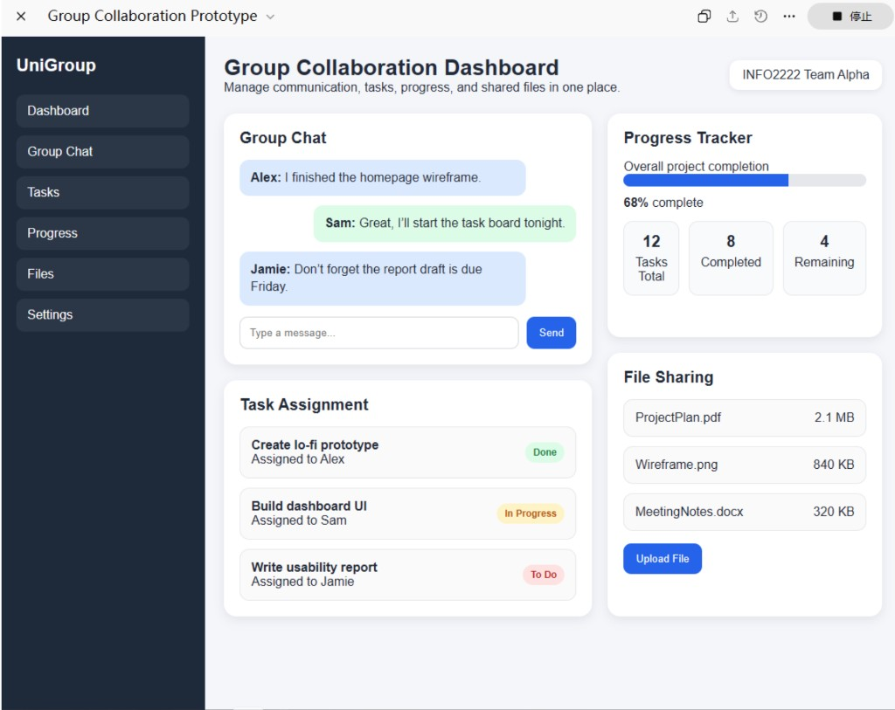
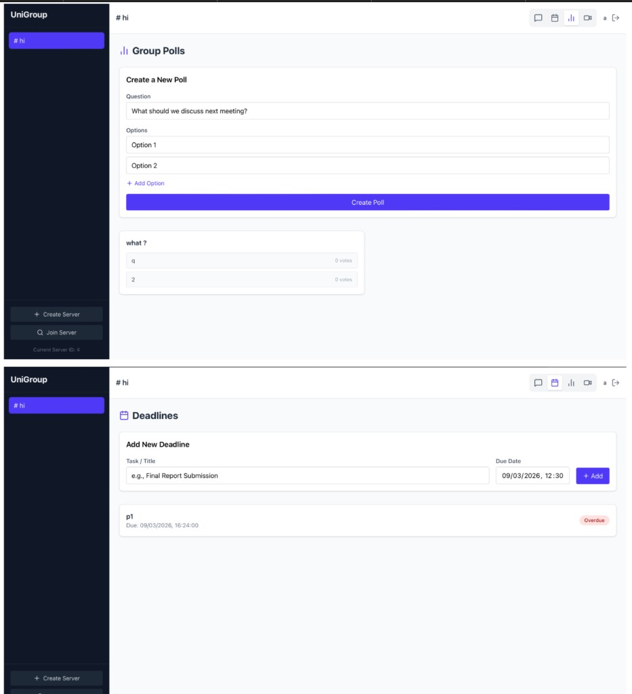
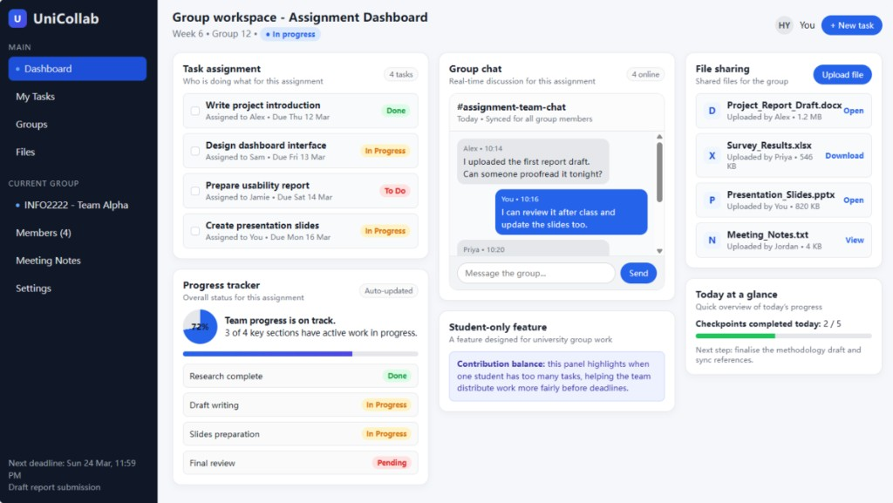
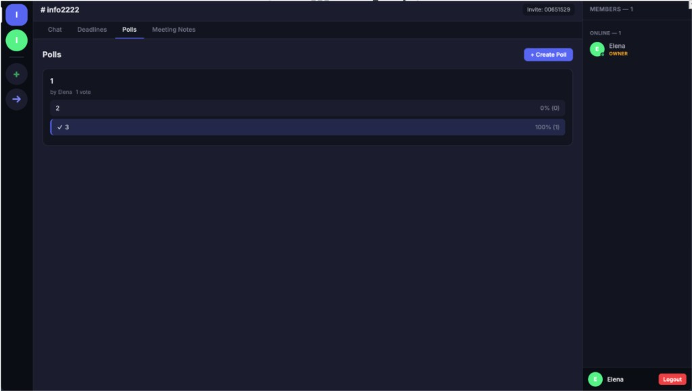

# TaskPilot — INFO2222 Group Collaboration Application

**T04G04-PH01** · INFO2222 2026 S1

A web-based communication program to assist university students in doing group work, with features similar to Discord or Teams.

# TaskPilot Hi-Fi Prototype

This repository contains the Hi-Fi prototype of TaskPilot, a web platform for university group work.
The prototype was designed using findings from interviews and survays we made.

# Folder Guide
## Folder name: claude_upload
```text
.
├── client/         # React + Vite frontend
├── server/         # Express + Socket.IO backend
├── package.json    # root scripts (start/dev/install)
└── README.md
```

# Replication Guide

### Prerequisites

- Node.js 18+ (recommended)
- npm 9+ (or compatible)
- macOS/Windows/Linux terminal

### 1) Install dependencies

From the repository root:

```bash
npm install
npm run install:all
```

### 2) Run the system

```bash
npm start
```

## Prototype Scope

The current Hi-Fi prototype focuses on team coordination and meeting support:

- Poll creation and voting
- Project and task management
- Deadline tracking
- Pinned content in team chat
- AI meeting summary (input + generated output)


## Tech Stack

| Layer     | Technology       |
| --------- | ---------------- |
| Frontend  | React 18, Vite   |
| Backend   | Node.js, Express |
| Real-time | Socket.IO        |
| Database  | SQLite (sql.js)  |
| Auth      | bcryptjs, JWT    |

table 1. Prompts Used in Developing the Hi-Fi Prototype

| Prompt Area                                | Prompt                                                                                                                                                                                                                                                                                                                                                                                                                                                                                                                                                                                                                                                                                                                                                                                                                                                                                                                                                                                                                                                                                                                                                                                                                                                                                                                                                                         |
| ------------------------------------------ | ------------------------------------------------------------------------------------------------------------------------------------------------------------------------------------------------------------------------------------------------------------------------------------------------------------------------------------------------------------------------------------------------------------------------------------------------------------------------------------------------------------------------------------------------------------------------------------------------------------------------------------------------------------------------------------------------------------------------------------------------------------------------------------------------------------------------------------------------------------------------------------------------------------------------------------------------------------------------------------------------------------------------------------------------------------------------------------------------------------------------------------------------------------------------------------------------------------------------------------------------------------------------------------------------------------------------------------------------------------------------------ |
| **First building-out framing prompt**      | I am building a Hi-Fi prototype for a student groupwork communication and project coordination system. This Hi-Fi prototype was developed based on the paper prototypes I have uploaded here, where two different paper prototype ideas were merged and refined into one more complete interactive system. Using the current Hi-Fi screenshots I have uploaded, analyse the current interface in detail and describe the display, navigation, structure, functionality, and workflow that are already present in the system. The interface should be a dark-theme collaborative workspace with tabs for Chat, Deadlines, Polls, Tasks, and Meeting Notes, a right-side member panel showing online users and the owner role, and a shared room- or project-based layout. The prototype should include a deadline tracker with due-date countdown display and add/delete controls; a polls/chat view with unvoted polls, hidden results until closing time, and pinned messages; a project and task management screen with project selection, progress summary, add project, add task, import PDF, weekly diary submission, and status columns for Todo, In Progress, and Done; a meeting summary input modal with title, date, summary/key notes, and pasted transcript fields; and a generated meeting notes screen that converts discussion into structured written records. |
| **Poll function**                          | My target version should let a user create a poll with a question, answer options, and a closing time. Other users should be able to vote once, see the poll either in the Polls tab or as a pinned item in chat, and the system should keep both views consistent. Before the poll closes, results may need to stay hidden or partially hidden to reduce bias. After the poll closes, the result should be visible and the status should update clearly. Please help me with this. Thank you.                                                                                                                                                                                                                                                                                                                                                                                                                                                                                                                                                                                                                                                                                                                                                                                                                                                                                 |
| **Poll sync issue**                        | Right now I have the following issue: if a user votes through the pinned poll in chat, the vote count on the Polls page still stays at 0. If the user votes from the Polls page, the pinned poll in chat does not update properly or disappear when it should. Could you please help me debug this? Thank you.                                                                                                                                                                                                                                                                                                                                                                                                                                                                                                                                                                                                                                                                                                                                                                                                                                                                                                                                                                                                                                                                 |
| **Deadline**                               | The final version should allow users to add deadlines, display due dates clearly, show countdown or urgency information, and let users delete or update deadlines when necessary. The feature should help students quickly understand what is due soon, what is overdue, and what belongs to a particular project or room.                                                                                                                                                                                                                                                                                                                                                                                                                                                                                                                                                                                                                                                                                                                                                                                                                                                                                                                                                                                                                                                     |
| **Tasks + Project board + phase tracking** | The target version should help student groups break assignment work into smaller parts, assign responsibility, update status, and monitor progress across project phases. I also want a weekly diary or contribution-related area to support accountability and reflection. The statuses should be Done, In Progress, and Todo. If the tasks have different levels of breakdown, please break them down to the last two levels. If the last level is not entirely made up of tasks, then do not treat it as one level. The flow should be that students import assignment outlines by uploading a PDF, and based on the PDF, the system should separate all tasks into blocks. Tasks should be updated manually across the three statuses and through the meeting summary workflow. Thank you.                                                                                                                                                                                                                                                                                                                                                                                                                                                                                                                                                                                 |
| **AI API to Meeting Summary feature**      | It should include a form with fields such as title, meeting date, optional key notes, and pasted transcript text. After submission, the system should send the relevant content to Gemini, receive a structured output, and display a meeting summary that helps the group understand what has been completed, what is in progress, what still needs to be done, and whether there are blockers or reminders. The transcript may contain informal language, spelling mistakes, incomplete sentences, repeated ideas, or unclear ownership. I want the output to be suitable for a university project workflow. It should clearly separate what has been completed, what is in progress, what is still to do, important reminders, blockers, and possible diary or follow-up items.                                                                                                                                                                                                                                                                                                                                                                                                                                                                                                                                                                                             |
| **Debug on Meeting Summary feature**       | Right now, the output misses key decisions, invents tasks that were never mentioned, fails to identify action items, and misclassifies completed work as future work. The system should extract candidate action items from the AI-generated meeting summary, identify possible owners, deadlines, priorities, or phases when they are available, and then let the user review those generated tasks before adding them to the project board.                                                                                                                                                                                                                                                                                                                                                                                                                                                                                                                                                                                                                                                                                                                                                                                                                                                                                                                                  |


---

## Project Prompt

The following prompt was used to guide the design and implementation of this project:

> Write a web-based communication program to assist university students in doing group work. The program should have features similar to programs such as Discord or Teams. Core functionality of the program should include the ability to: create, join servers, and chat with each other, with the user name on the side of the message. Users should be able to create an account and log in, and have a persistent list of servers that they are part of, and each server should have a persistent list of members and chat messages, and the chat messages should update in real time using websockets. Information about users, servers, members, and messages should be stored in a database, and secure account information should be encrypted for security. Additional productivity features should be added to aid in group work, such as a deadline tracker, the ability to pin messages, polls, and a video call summary system. The program should use Node.js and React. Could you provide code that works and has completed UI when we run it without any changes?

---

## AI-Generated Prototypes

Prototype UIs were generated using different AI tools. Below are the resulting designs.

### ChatGPT prototype



### Gemini prototype



### Perplexity prototype



### Claude prototype



---

## How to Run Each Prototype

Each AI prototype is in its own folder. `cd` into the folder and follow its README:

| Folder | AI Tool | Quick Start |
|--------|---------|-------------|
| `claude opus/` | Claude | `cd "claude opus" && npm run install:all && npm install && npm run dev` |
| `gemini/` | Gemini | `cd gemini && npm install && npm start` |

---

## Repository

- **Git:** https://github.sydney.edu.au/INFO2222-2026-S1/T04G04-PH01-TaskPilot.git
